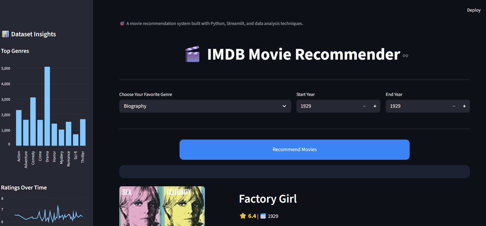
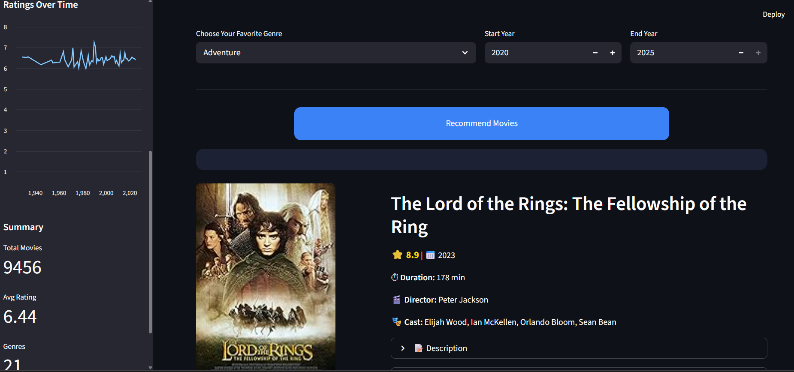
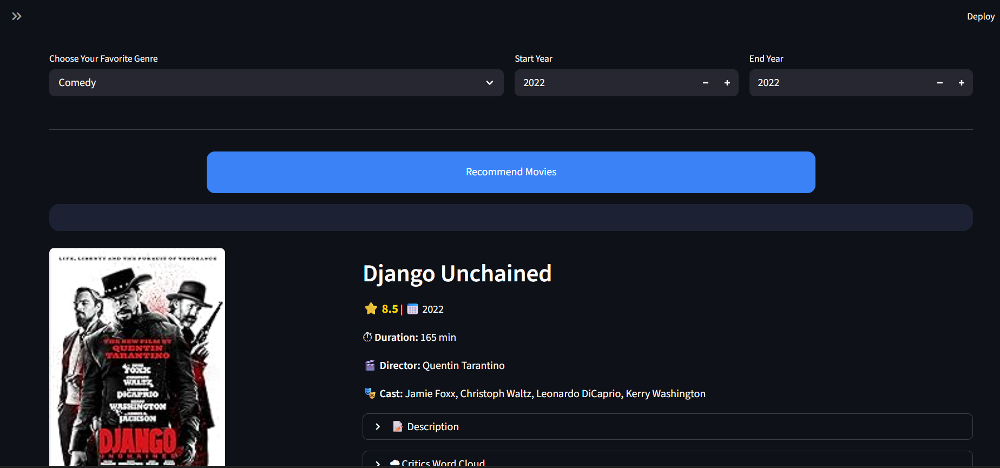

# 🎬 Movie Recommendation App

## 📌 Description
This project is a Movie Recommendation Web App built using Streamlit.  
It allows users to explore movies based on genre, release year, and ratings.

The app provides an interactive interface where users can view movie posters and detailed information for each movie, including the title, director, cast, duration, and a short description. It also includes direct IMDb links for more details.

## ✨ Features
- 🎭 Filter movies by genre.
- 📅 Select a specific year or range.
- ⭐ View top-rated movies.
- 🖼️ Display movie posters.
- 📊 Interactive and simple UI.

## 🖼️ Demo

 ### Screenshots For Some Filtered Results

## ▶️ Usage
- Select your favorite genre.
- Choose a year or range.
- Click the "Recommend" button.
- Browse movie posters and details.

## 🛠️ Technologies Used
- Python.
- Streamlit.
- Pandas.
- HTML/CSS (for styling).
## 📊 Dataset
The app uses the [**IMDB Movies Dataset**](https://www.kaggle.com/datasets/amanbarthwal/imdb-movies-data) from Kaggle, which contains information on the top 1000 movies and TV shows by IMDB rating.

### Dataset Details:
- **Poster:** Link to the movie poster.

- **Title:** Name of the movie.

- **Year:** Year the movie was released.

- **Certificate:** Age rating (e.g., PG, R).

- **Duration (min):** Length of the movie in minutes.

- **Genre:** Genre(s) of the movie.

- **Rating:** IMDB user rating.

- **Metascore:** Score aggregated from professional critics.

- **Director:** Name of the director(s).

- **Cast:** Main actors in the movie.

- **Votes:** Number of votes the movie received on IMDB.

- **Description:** Brief summary of the movie's plot.

- **Review Count:** Total count of reviews.

- **Review Title:** Title of a top review.

- **Review:** The text of a top movie review.

## 🙏 Acknowledgments

I would like to express my sincere gratitude to:

| Contributor | Reason |
|-------------|--------|
| **Aman Barthwal** | For creating and sharing the [IMDB Movies Dataset](https://www.kaggle.com/datasets/amanbarthwal/imdb-movies-data) on Kaggle |
| **Kaggle** | For providing a platform to host and share valuable datasets with the community |
| **Streamlit** | For developing an amazing framework that makes building data apps simple and intuitive |
| **All Contributors & Testers** | For their valuable feedback, suggestions, and support in improving this project |

### 📚 **Additional Thanks**
- The open-source community for continuous inspiration.
- Everyone who takes the time to use and review this app.

---

## 👩‍💻 Author
### **Aya Salah**
- GitHub: https://github.com/AyaSalah19
- LinkedIn: [www.linkedin.com/in/aya-salah-a36858203](https://www.linkedin.com/in/aya-salah-a36858203/) 

